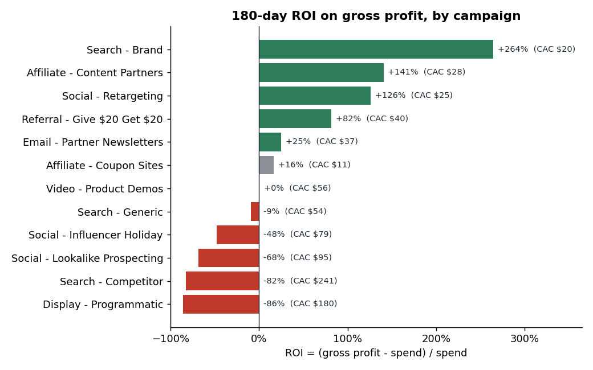
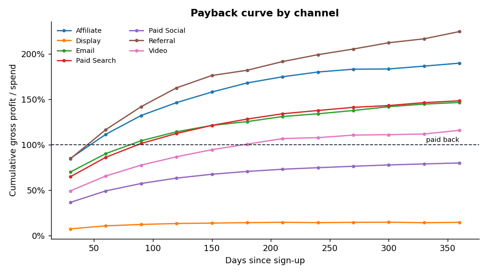
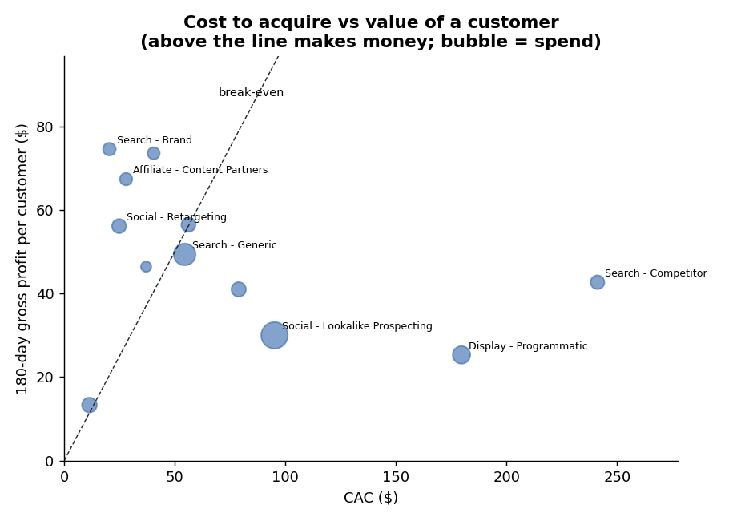
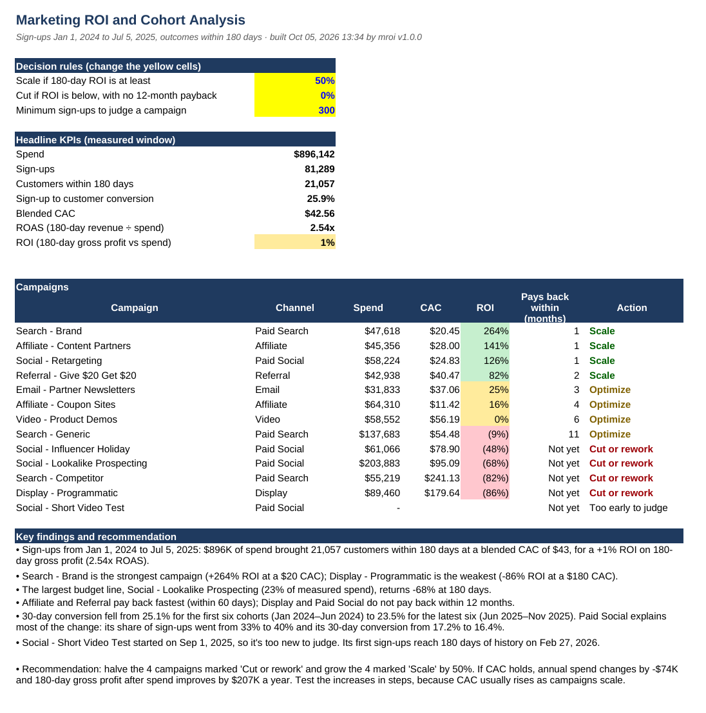

# Marketing ROI and Cohort Analysis

A SQL-first analysis of marketing performance for a direct-to-consumer brand running 13 campaigns across 7 channels. It answers the questions a marketing lead asks before moving budget:

- **What does a customer cost?** Customer acquisition cost (CAC) by campaign and channel.
- **How fast do sign-ups turn into customers?** Cohort conversion by sign-up month.
- **Which campaigns make money?** ROAS and ROI on 180-day gross profit, plus how many months each campaign takes to pay back.
- **Where should the budget go?** A decision for every campaign (Scale, Optimize, Cut or rework, Too early to judge) and a what-if budget scenario.

```
data/raw/*.csv ──► SQL in DuckDB (sql/01-07) ──► output/marketing.duckdb
                                               ├─► output/marts/*.csv            (Power BI feed)
                                               └─► output/Marketing_ROI_Report.xlsx  (formula-driven Excel report)
```

**About the data.** Real campaign spend joined to customer-level revenue isn't publicly available, so `python -m mroi generate` simulates two years (2024–2025) of a realistic brand. Each campaign has its own click costs, conversion rates, order values, margins and repeat-purchase habits, and every first order carries a 20% welcome discount. The SQL doesn't know any of that: it works out every result from the raw tables, exactly as it would with real data. To use real data instead, supply the same four CSV files (see Step 3).

`sample_output/Marketing_ROI_Report_sample.xlsx` shows the finished Excel report.

## Results

Built on a simulated two-year dataset (13 campaigns, 7 channels, ~118K sign-ups, ~52K orders). All 9 data-quality checks pass and all 11 unit tests pass.

| Metric (sign-ups Jan 2024 – Jul 2025, 180-day outcomes) | Value |
|---|---|
| Measured spend | $896K |
| Customers acquired | 21,057 |
| Blended CAC | $43 |
| ROAS (revenue ÷ spend) | 2.54x |
| ROI on gross profit | +1% |

**Key findings**

- **Search - Brand** is the strongest campaign (+264% ROI at a $20 CAC); **Display - Programmatic** is the weakest (-86% ROI at a $180 CAC).
- The largest budget line, **Social - Lookalike Prospecting** (23% of measured spend), returns **-68%** at 180 days.
- **Affiliate and Referral** pay back within 60 days; **Display and Paid Social** don't pay back within 12 months.
- 30-day conversion fell from **25.1% to 23.5%** between the first and latest six cohorts. Most of the drop is mix: Paid Social grew from 33% to 40% of sign-ups and converts below average.

**Recommendation:** halve the 4 campaigns marked *Cut or rework* and grow the 4 marked *Scale* by 50%. If CAC holds, annual spend falls by **$74K** while 180-day gross profit after spend improves by **$207K a year**. Scale in steps, because CAC usually rises with budget.



| | |
|---|---|
|  |  |



Regenerate the charts after a build with `python scripts/make_charts.py`.

---

## Project structure

```
marketing-roi-cohort-analysis/
├── sql/
│   ├── 01_staging.sql             # load CSVs into typed tables, set run parameters
│   ├── 02_users.sql               # one row per sign-up: conversion flags, 180-day value
│   ├── 03_payback.sql             # cumulative gross profit vs spend by 30-day period
│   ├── 04_cohort_conversion.sql   # cohort triangle with maturity rules
│   ├── 05_campaign_scorecard.sql  # spend, customers, CAC, ROAS, ROI, payback per campaign
│   ├── 06_channel_monthly.sql     # monthly trend by channel
│   ├── 07_powerbi_views.sql       # dimensions and facts for Power BI
│   └── checks.sql                 # data quality checks
├── mroi/
│   ├── __main__.py                # command line: generate, build, query
│   ├── generate.py                # simulated raw data
│   ├── database.py                # runs the SQL, checks and exports
│   ├── insights.py                # decision rules, budget scenario, written findings
│   ├── excel_report.py            # the Excel report
│   └── config.py                  # thresholds and settings
├── powerbi/
│   ├── measures.dax               # DAX measures to paste into Power BI
│   └── theme.json                 # report colours
├── scripts/make_charts.py         # README charts in docs/
├── docs/                          # charts and report screenshot
├── tests/test_pipeline.py
├── data/raw/                      # the four raw CSV files go here
└── sample_output/
```

---

## Step 1. Install the tools

| Tool | Why | Where |
|---|---|---|
| Python 3.10 or newer | runs the pipeline (DuckDB installs with pip, no database server needed) | python.org/downloads (Windows: tick **Add python.exe to PATH**) |
| Microsoft Excel (or Google Sheets / LibreOffice) | opens the report | — |
| Power BI Desktop (free, Windows only) | dashboard | Microsoft Store or powerbi.microsoft.com |
| Git and a GitHub account | publishing | git-scm.com, github.com |
| DBeaver (optional) | browse the DuckDB database with a SQL editor | dbeaver.io |

## Step 2. Set up the project

Open a terminal **inside the project folder**.

**Windows (Command Prompt):**

```
python -m venv .venv
.venv\Scripts\activate
pip install -r requirements.txt
```

**macOS / Linux:**

```
python3 -m venv .venv
source .venv/bin/activate
pip install -r requirements.txt
```

## Step 3. Generate the data

```
python -m mroi generate
```

This writes four files to `data/raw/` (about 118,000 sign-ups and 52,000 orders):

| File | Columns | One row per |
|---|---|---|
| `campaigns.csv` | campaign_id, campaign_name, channel, objective, start_date, end_date | campaign |
| `daily_spend.csv` | spend_date, campaign_id, spend, impressions, clicks | campaign per day |
| `signups.csv` | user_id, signup_date, campaign_id | sign-up (credited to the campaign that brought them) |
| `orders.csv` | order_id, user_id, order_date, revenue, cost_of_goods | order |

The data is seeded, so it comes out the same every run. Options: `--start`, `--end`, `--seed`.

## Step 4. Build everything

```
python -m mroi build
```

You should see this (or numbers very close to it):

```
INFO    Loaded 13 campaigns, 7,951 spend rows, 117,557 sign-ups and 52,379 orders (data ends 2025-12-31)
INFO    Data checks: all 9 passed
INFO    Measured window: sign-ups 2024-01-01 to 2025-07-05, outcomes within 180 days
INFO    Spend $896K | customers 21,057 | blended CAC $43 | ROI +1%
INFO    Excel report: output/Marketing_ROI_Report.xlsx
INFO    Power BI feed: output/marts (9 CSV files)
INFO    Database: output/marketing.duckdb

Key findings:
  - Sign-ups from Jan 1, 2024 to Jul 5, 2025: $896K of spend brought 21,057 customers within 180 days ...
  - Search - Brand is the strongest campaign (+264% ROI at a $20 CAC); Display - Programmatic is the weakest ...
  - The largest budget line, Social - Lookalike Prospecting (23% of measured spend), returns -68% at 180 days.
  ...
```

| Output | What it is |
|---|---|
| `output/Marketing_ROI_Report.xlsx` | the Excel report (Step 6) |
| `output/marts/*.csv` | nine tables for Power BI (Step 7) |
| `output/marketing.duckdb` | the database with every table, for your own SQL |

Option: `--horizon 90` measures outcomes over 90 days instead of 180.

**Why a "measured window"?** A customer who signed up last week hasn't had time to buy, so including them would make recent campaigns look worse. Every campaign is judged on sign-ups with a full 180 days of history (here, up to Jul 5, 2025), and on the spend over the same dates.

## Step 5. The SQL, file by file

The SQL does the analysis; Python only runs it and formats the results. Read the files in order:

| File | What it builds | Techniques worth pointing out |
|---|---|---|
| `01_staging.sql` | typed copies of the raw tables, plus a one-row `params` table (data end date, horizon, cutoff) | explicit casts; one place for run parameters |
| `02_users.sql` | `int_users`: one row per sign-up with first purchase date, 7/30/180-day conversion flags, and 180-day orders, revenue and gross profit | CTEs, `MIN()` for first purchase, conditional `CASE` flags, date arithmetic |
| `03_payback.sql` | `mart_payback`: cumulative gross profit vs spend for each campaign and 30-day period | non-equi joins (`<=` on dates) to count only users with a full window |
| `04_cohort_conversion.sql` | `mart_cohort_conversion`: the cohort triangle | `CROSS JOIN` to a periods table, a maturity filter that blanks incomplete cells |
| `05_campaign_scorecard.sql` | `mart_campaign_scorecard`: spend, customers, CAC, ROAS, ROI, payback | aggregating each source before joining (no double counting), `NULLIF` against divide-by-zero |
| `06_channel_monthly.sql` | `mart_channel_monthly`: monthly spend, sign-ups and first purchases by channel | building a complete month × channel grid with `UNION` before joining |
| `07_powerbi_views.sql` | dimension and fact views for Power BI | star-schema shape |
| `checks.sql` | nine data quality checks (unknown IDs, duplicates, orders before sign-up, negative amounts...) | each check returns the number of failing rows |

Run your own queries against the built database:

```
python -m mroi query "SELECT campaign_name, cac, roi, payback_months FROM mart_campaign_scorecard ORDER BY roi DESC"
python -m mroi query "SELECT channel, SUM(signups) AS signups FROM mart_channel_monthly GROUP BY channel"
```

Or open `output/marketing.duckdb` in DBeaver (New connection → DuckDB) to browse it.

## Step 6. Read the Excel report

| Sheet | Shows |
|---|---|
| **Summary** | decision rules (yellow inputs), headline KPIs, every campaign with its action, key findings and the recommendation |
| **Scorecard** | per campaign: the SQL counts and sums ("From SQL"), and the rates computed by Excel formulas ("Calculated in Excel"): CTR, CPC, sign-up rate, cost per sign-up, conversion, CAC, ROAS, ROI, LTV:CAC, Action |
| **Cohort Conversion** | counts and conversion rates by sign-up month and days since sign-up, as a heatmap, plus a 30-day conversion trend chart |
| **Payback** | payback ratio by channel and month, with "pays back within" and a chart (100% = paid back) |
| **Budget Scenario** | change the yellow % cells to see the effect on spend, customers and gross profit |
| **Channel Monthly** | spend, first purchases and CAC by month and channel, with charts |
| **Data Checks** | the nine checks, all should say Pass |
| **Definitions** | every metric explained, plus run details |

Change the decision rules on the Summary sheet (for example, scale only above 75% ROI) and the actions update everywhere.

## Step 7. Build the Power BI dashboard

1. **Load the data.** Open Power BI Desktop → **Get data** → **Text/CSV**, and load each file in `output/marts` (repeat for all nine). Click **Load**, not Transform.
2. **Check types** in Table view: dates (`spend_date`, `signup_date`, `order_date`, `first_order_date`, `cohort_month`, `month`) as Date, money columns as Decimal number.
3. **Add a date table.** Modeling → **New table**:
   ```
   Date = ADDCOLUMNS ( CALENDAR ( DATE ( 2024, 1, 1 ), DATE ( 2025, 12, 31 ) ),
       "Month", DATE ( YEAR ( [Date] ), MONTH ( [Date] ), 1 ), "Year", YEAR ( [Date] ) )
   ```
   Then **Mark as date table** (Table tools) using the Date column.
4. **Relationships** (Model view, drag column to column, one-to-many):
   - `dim_channel[channel]` → `dim_campaign[channel]`, `mart_cohort_conversion[channel]`, `mart_channel_monthly[channel]`
   - `dim_campaign[campaign_id]` → `fact_spend[campaign_id]`, `fact_users[campaign_id]`, `mart_payback[campaign_id]`
   - `fact_users[user_id]` → `fact_orders[user_id]`
   - `Date[Date]` → `fact_spend[spend_date]` and `fact_users[signup_date]`
5. **Measures.** Open `powerbi/measures.dax` and create each measure with **Modeling → New measure**. Format CAC and GP per Customer as currency, the conversion, ROI and ratio measures as percentages, and ROAS as a decimal.
6. **Theme.** View → Themes → **Browse for themes** → `powerbi/theme.json`.
7. **Build four pages:**
   - **Overview:** cards for Spend (measured), Customers (180d), CAC and ROI (180d); a bar chart of ROI (180d) by `campaign_name`, coloured by the `ROI Colour` measure (Format → Bars → fx → Field value); a scatter of CAC (x) vs GP per Customer (y), sized by Spend (measured) with channel as legend (points above the diagonal make money).
   - **Cohorts:** a matrix with `cohort_month` on rows, `within_days` on columns and Cohort Conversion % as values, with background colour scales (Format → Cell elements); a line chart of Cohort Conversion % by `within_days` with channel as legend.
   - **Payback:** a line chart with `days_since_signup` on the x-axis, Payback Ratio on the y-axis and channel as legend; add a constant line at 1 (Analytics pane).
   - **Trends:** a stacked column chart of Spend (monthly) by `month` and channel; a line chart of Monthly CAC by month.
8. Add **slicers** for channel (from `dim_channel`) and campaign (from `dim_campaign`) and set them to filter all pages (View → Sync slicers).
9. **Save** the `.pbix`. To share it, publish to the Power BI Service if you have a work or school account, or export to PDF (File → Export) and add screenshots to GitHub.

## Step 8. Run the tests

```
python -m pytest
```

The tests run the real SQL on a tiny dataset whose answers were worked out by hand. They check the conversion flags, the measured window, CAC, ROAS, ROI and payback, the cohort maturity rule and the data checks, and they confirm the generator is reproducible.

## Step 9. Publish on GitHub

```
git init
git add .
git commit -m "Marketing ROI and cohort analysis: SQL, Excel and Power BI"
git branch -M main
git remote add origin https://github.com/venkatesh-kashinatha/marketing-roi-cohort-analysis.git
git push -u origin main
```

Add screenshots of the Summary sheet and two Power BI pages to a `docs/` folder and show them near the top of this README. Raw data and outputs are excluded by `.gitignore`; anyone can regenerate them with two commands.

## Step 10. Use it on your resume

Take your finding and recommendation from the Summary sheet. Because the data is simulated, describe it as a "simulated two-year marketing dataset" if asked; interviewers care about how you measured, not whose data it was.

## Talking points for interviews

- **Fair comparison:** campaigns are judged on sign-ups with a full 180 days of history, so new campaigns aren't penalised and old ones aren't flattered. The same rule blanks incomplete cells in the cohort triangle.
- **ROI on gross profit, not revenue:** revenue-based ROAS ignores the cost of goods. Coupon affiliates have a 6x ROAS but only 16% ROI because their customers buy at low margins.
- **Payback adds nuance:** generic search loses 9% at 180 days but pays back by month 11, so it's "Optimize", not "Cut".
- **Explaining a trend:** the drop in 30-day conversion is split into mix (which channels grew) and rate (how each channel converted), and Paid Social's growth explains most of it.
- **Attribution caveat:** sign-ups are credited to one campaign (first touch). Retargeting probably claims some customers who would have bought anyway, so its ROI is likely overstated; a holdout test would measure its true effect.
- **Scenario caveat:** the budget scenario assumes CAC stays flat. In practice CAC rises as a campaign scales, so increases should be tested in steps.
- **Quality:** nine data checks run before the analysis, and unit tests verify the SQL against hand-calculated answers.

## Running the SQL in PostgreSQL (optional)

Only `01_staging.sql` is DuckDB-specific (`read_csv`). In PostgreSQL, create the four staging tables and the `params` table, load the CSVs with `COPY`, then run files 02–07. The analysis files use standard SQL (CTEs, `CASE`, `NULLIF`, date arithmetic). The main change is replacing `CREATE OR REPLACE TABLE x AS` with `DROP TABLE IF EXISTS x; CREATE TABLE x AS`.

## Troubleshooting

| Problem | Fix |
|---|---|
| `Missing raw file(s)` | Run `python -m mroi generate` first, or put your four CSV files in `data/raw`. |
| `No module named mroi` | Run commands from the project folder (the one containing `mroi/`). |
| "Close it if it's open in Excel" | Excel locks open files on Windows; close the report and rerun. |
| Database is locked | Close DBeaver (or any other program using `marketing.duckdb`) and rerun. |
| Numbers look blank in a preview | Open the report in Excel or Google Sheets, which calculate formulas on open. |
| A data check says Fail | The report still builds, but fix the raw data first; the check name tells you what's wrong. |

Tested with Python 3.12, DuckDB 1.5, pandas 3.0 and openpyxl 3.1.
